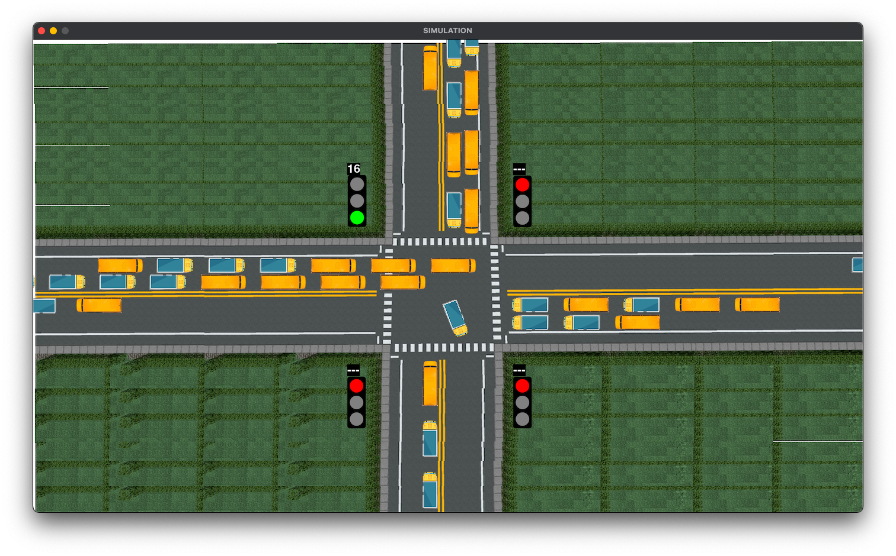

<p align="center">
 
</p>

<h1 align="center">Traffic Intersection Simulation with Turns</h1>

<div align="center">

[](https://www.python.org/downloads/)
[](https://opensource.org/licenses/MIT)

<h4>A simulation developed from scratch using Pygame to simulate the movement of vehicles across a traffic intersection having traffic lights with a timer. Additional features added to existing basic simulation to take it closer to real-life scenarios and use it effectively in Data Analysis tasks or AI applications.</h4>

</div>

-----------------------------------------
### Features added:

* `Vehicle Turning Functionality` - Unlike the previous simulation where all the vehicles went straight through the intersection, some of the vehicles will be turning left, some right, and some will go straight in the modified simulation.
* `Vehicle Type Controller` - This feature lets us choose which vehicle types among  car, bus, truck and bike, we want in our simulation.
* `Random Green Signal Timer` - If enabled, this feature sets the green signal time equal to a random number generated within a given range.

------------------------------------------
### Demo

The video below shows the final output of the simulation.

<p align="center">
    
</p>

------------------------------------------
### Prerequisites

[Python 3.1+](https://www.python.org/downloads/)

------------------------------------------
### Installation

 * Step I: Clone the Repository
```sh
      $ git clone https://github.com/mihir-m-gandhi/Traffic-Intersection-Simulation-with-Turns
```
  * Step II: Install the required packages
```sh
      # On the terminal, move into Traffic-Intersection-Simulation-with-Turns directory
      $ cd Traffic-Intersection-Simulation-with-Turns
      $ pip install pygame
```
* Step III: Run the code
```sh
      # To run simulation
      $ python simulation.py
```

------------------------------------------
### Author

Mihir Gandhi - [mihir-m-gandhi](https://github.com/mihir-m-gandhi)

------------------------------------------
### License
This project is licensed under the MIT - see the [LICENSE](./LICENSE) file for details.
